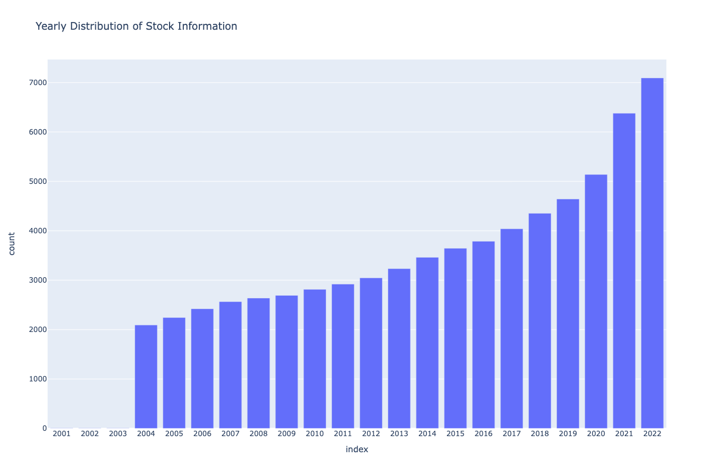
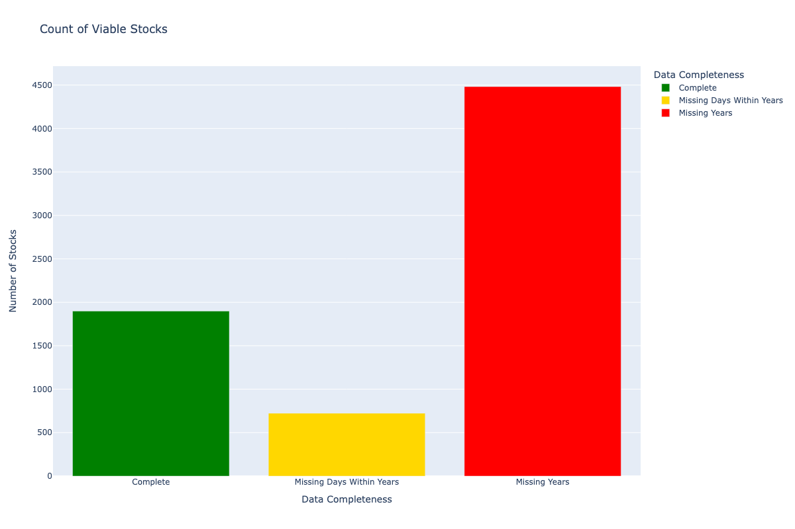
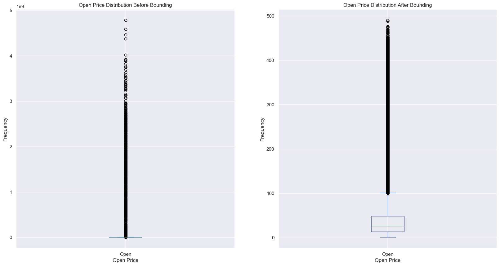
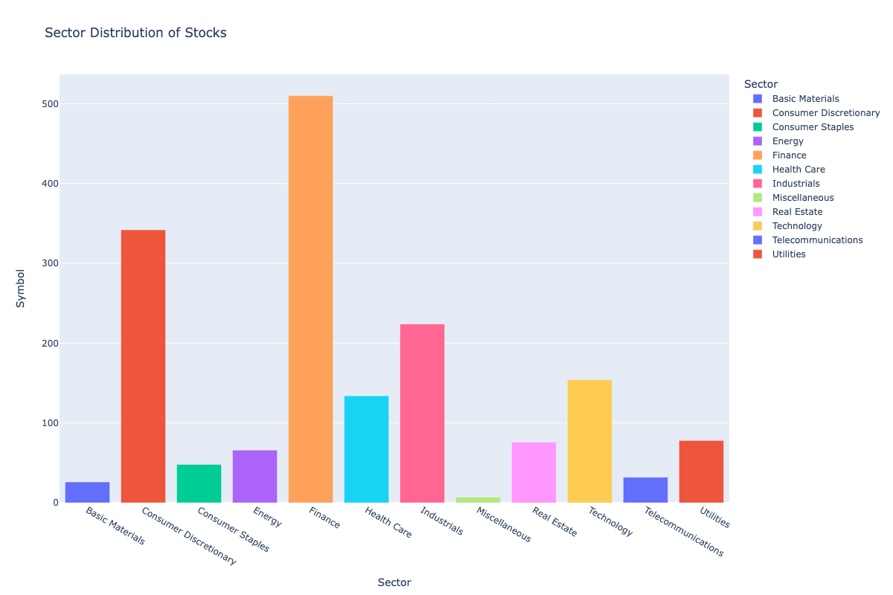
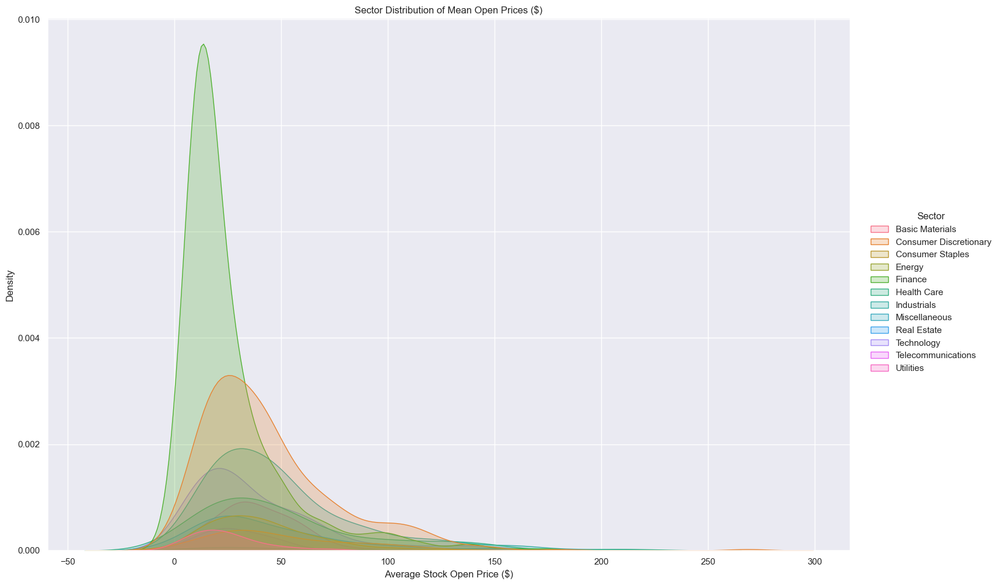
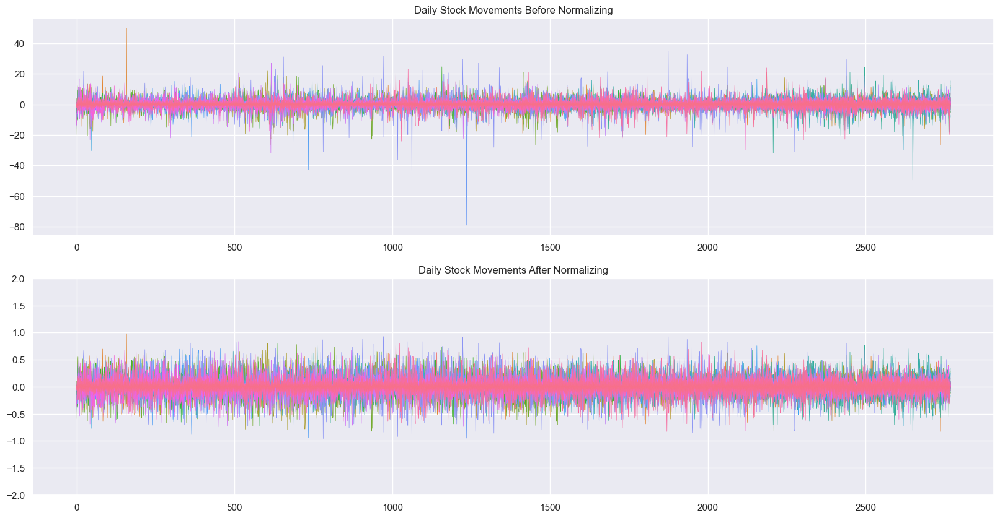
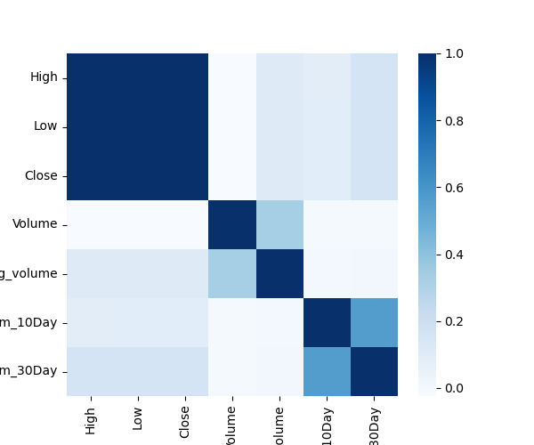
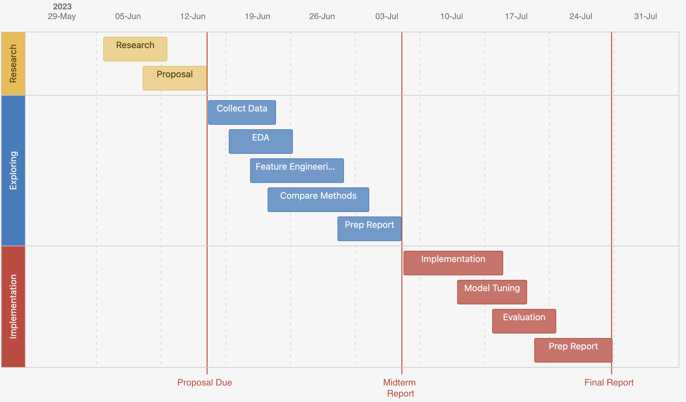

# Machine Learning: Group 6 - Project Proposal

### Team Members: Curran Myers, Tilman Gromme, Braden Dunaway, Bryce McNealey, Justin Yang

## Project Introduction and Background

It's very difficult for hedge funds and day traders to outperform the market (i.e. stable index funds) over a long time. Stock market public accessibility is increasing with technologies like Robinhood, TD Ameritrade, Bitwallet, etc becoming more relevant. Accurate predictions of the stock market can assist in education and help advise important financial planning and decisions for companies and individuals alike.

---

## Problem Definition

Our team seeks to outperform the market (index funds: S&P 500, NASDAQ, etc.). We will implement the most recent methods of decision tree day-by-day to determine which stocks to buy or sell, given a principal amount of money, that maximizes profit and minimizes risk.

---

## Dataset
For our dataset, we are making use of [Marketdata’s API](https://docs.marketdata.app/api) to collect daily historical data for thousands of stock symbols over the past two decades.  The stock symbols are gathered from the [NASDAQ’s Stock Sceener](https://www.nasdaq.com/market-activity/stocks/screener), which provides basic information on stocks listed on the NASDAQ, NYSE, and AMEX.  This data will provide a solid foundation for engineering other indicator features to help the model predict future results.  Additionally, building a custom dataset allows the team to preprocess out unnecessary or irrelevant data thus reducing the overhead for data cleaning.

---

## Potential Methods and Techniques

For our model we will consider:
- **Random Forest Regression**: We would utilize an ensemble of decision trees, each with their own subset of (financial) features and samples (of stocks), to predict which stocks we should purchase and sell. We anticipate this method will be effective in capturing feature relationships and reducing overfitting. 

- **XGBoost**: As an option to further the Random Forest Regression, we will also consider using Extreme Gradient Boosting.  Due to the fact our data will be a time series, the sequential training XGBoost provides will help to more accurately extrapolate and forecast the trends in our data.  XGBoost has a python package from the developers **xgboost** [1].

- **Naive Bayes**: Assumes the stock’s features are conditionally independent and using Bayes Theorem, predicts the direction of stock price movements to suggest which stocks we may purchase or sell. We can use a variety of libraries to accomplish this, including **sci-kit-learn**.

To provide whichever model we decide to use with quality data, we will employ several methods in preprocessing to aid in reducing training time while maintaining data integrity and information.  These methods include feature engineering and compression among others. Ideally this process will make the model perform equally well if not better while reducing overhead.

---

## Results and Discussion

In order to quantify our project results, we plan to employ the following metrics in order to fully represent our findings. When employing a regression model of Random Forest, the following metrics such as mean squared error, root mean squared error and R^2 would prove useful in forming performance benchmarks of our implementation [3]. For a Naïve Bayes classification approach, “accuracy and f-measure are used” [2] for creating performance benchmarks on the status of this approach.

### Dataset Collection and Cleaning

As stated earlier we used [Marketdata’s API](https://docs.marketdata.app/api) to collect information on numerous different stocks detailed by [NASDAQ’s Stock Sceener](https://www.nasdaq.com/market-activity/stocks/screener).  The data was gathered by making numerous HTTP GET requests and a response was recevied, which was then saved in JSON format.  If the response was empty or an error for no available data, it was not saved to alleviate preprocessing overhead.  Once all the stock data was gathered, we had received roughly 20 years worth of daily measures for thousands of different stocks.

<center>  </center>

We decided the the most "normal" selection of data would be from March 1st, 2009 through Feb 28th, 2020.  This would ideal train the model on the economy in a "normal" period uneffected by the 2008 housing crisis or the 2020 pandemic.  So, now all that was left to do was select all stocks that had completeness across the years and days within the year.  Even though a large portion of the data was not complete through the time range we selected, we still are left with a notable quantity of data for our base dataset. 

### Exploratory Data Analysis

In EDA, the goal was to better understand our data before doing any additional processing.  The first thing we did (knowing all NaN values had already been processed out) was generate some descriptive statistics on each stock by grouping them.  We realized that there were some stocks that were far too large or small to be included within the data.  So, we decided to bound the data from a minimum of 1 to a maximum of 500.
<br>
<center></center>
<br>
We then performed some analysis on how the stocks were distributed among sectors.  For risk assessment of a portfolio later, it is beneficial to not keep all investments in one sector as sectors can trend as a whole.  To gather some insights into this information, the naive solution was to plot the count of stocks present for each sector.  We also used KDE to visualize the distribution of the average opening price for all stocks in the sector across the time time range.  Together, we observed that out dataset does have a bias towards the finance and consumer discretionary sectors, but the relative maximum likelihood across sectors is fairly similar.
<br>
<center>


</center>
<br>
Lastly, we decided to do some noramlization of the data.  Using sklearn and numpy, we were able to create NxM arrays of the opening and closing prices each day in order to calculate the daily movements of a stock.  Below we show how we can use the normalizer to preprocess our data for the model.
<br>
<center></center>

### Supervised Learning Technique

Our problem space necessitated the usage of a supervised, regression machine learning technique. This can be demonstrated by the manner with which we supply both the features and targets that we intend to create a viable mapping from the data to the prediction. In addition, we intend to create target values that exist on a continuous, numerical scale (stock price).

### Feature Engineering

We sought out to add additional features to our dataset, including highly recommended features for time series financial data. These features include logvolume, i.e. log(volume), 10 and 30 day lagging *momentum*, which is determined using close price: Close - Close(10 days ago)

After doing so, The dataset required cleaning to remove the first 30 days of data, as they contained NaNs for our lagging features. 
To clean this precautionarily, we defined the following function:
```
def clean_dataset(df):
    df.dropna(inplace=True)
    indices_to_keep = ~df.isin([np.nan, np.inf, -np.inf]).any(axis=1)
    return df[indices_to_keep].astype(np.float64)
```
Which drops any NaNs, infinite values, and converts our feature values to np.float64 as required to execute some sklearn functions.

Further, it makes much sense to plot feature correlations and begin to explore their variance for their feasibility in actual machine learning models. Using seaborn, the heatmap of feature correlations was generated: 
<br>
<center></center>
<br>
Note that High, Low, and Close appear correlated - we may therefore remove some to aid implementation. 

---

## References

- [1] Chen, T., & Guestrin, C. (2016, August). Xgboost: A scalable tree boosting system. In Proceedings of the 22nd acm sigkdd international conference on knowledge discovery and data mining (pp. 785-794).
- [2] Patel, J., Shah, S., Thakkar, P., & Kotecha, K. (2015). Predicting stock and stock price index movement using trend deterministic data preparation and machine learning techniques. Expert systems with applications, 42(1), 259-268.
- [3] Plevris, Vagelis & Solorzano, German & Bakas, Nikolaos & Ben Seghier, Mohamed. (2022). Investigation of performance metrics in regression analysis and machine learning-based prediction models. 10.23967/eccomas.2022.155. 

---

## Project Timeline



---

## Work Contribution Table

|       Task          |  Time Window  | Responsible Member(s) | Work Completed  |
|       :---:         |    :---:      |        :---:          |       :--:      |
| Research            | 06/06 - 06/13 | All Members           |                 |
| Proposal            | 06/13 - 06/16 | All Members           |                 |
| Data Collection     | 06/16 - 06/24 | Braden                |                 |
| Exp. Data Analysis  | 06/19 - 06/26 | Braden                |                 |
| Feature Engineering | 06/21 - 07/02 | Curran                |                 |
| Comparing Models    | 06/23 - 07/05 | Bryce                 |                 | 
| Midterm Report      | 07/02 - 07/07 | All members           |                 |
| Implementation      | 07/07 - 07/19 | Tilman                |                 |
| Model Tuning        | 07/14 - 07/21 | Justin                |                 |
| Evaluation          | 07/19 - 07/24 | Curran                |                 |
| Final Report        | 07/22 - 07/25 | All Members           |                 |

---

## Checkpoint

For team checkpoints, we meet weekly to review the progress of current phases and completed phases.  This aids in aligning our team on project goals and properly distributing work among team members.  These project meetings will occur until the project has reached completion at the end of the term.

