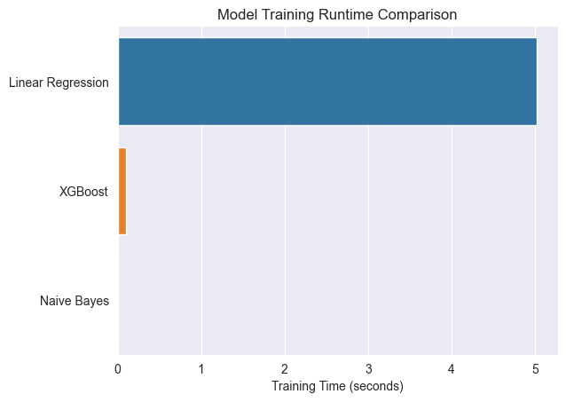
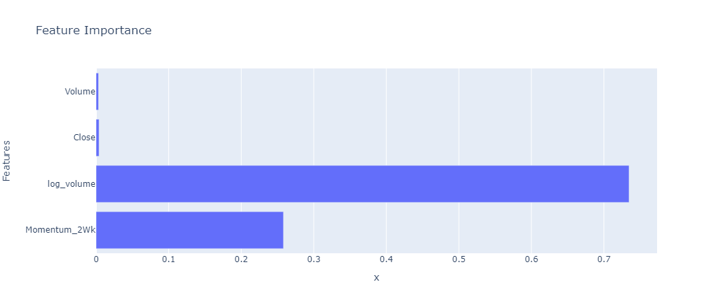
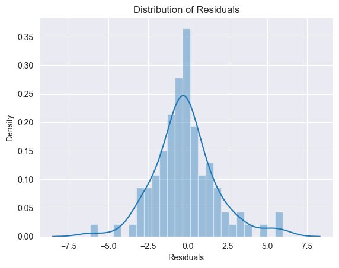
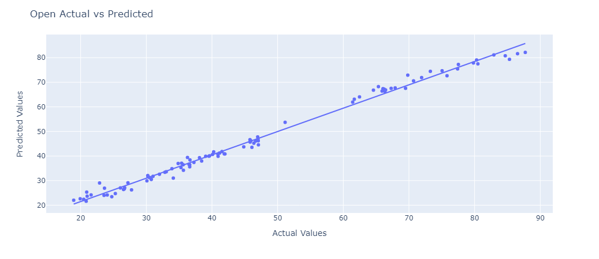
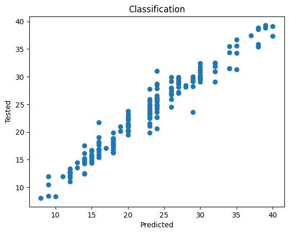
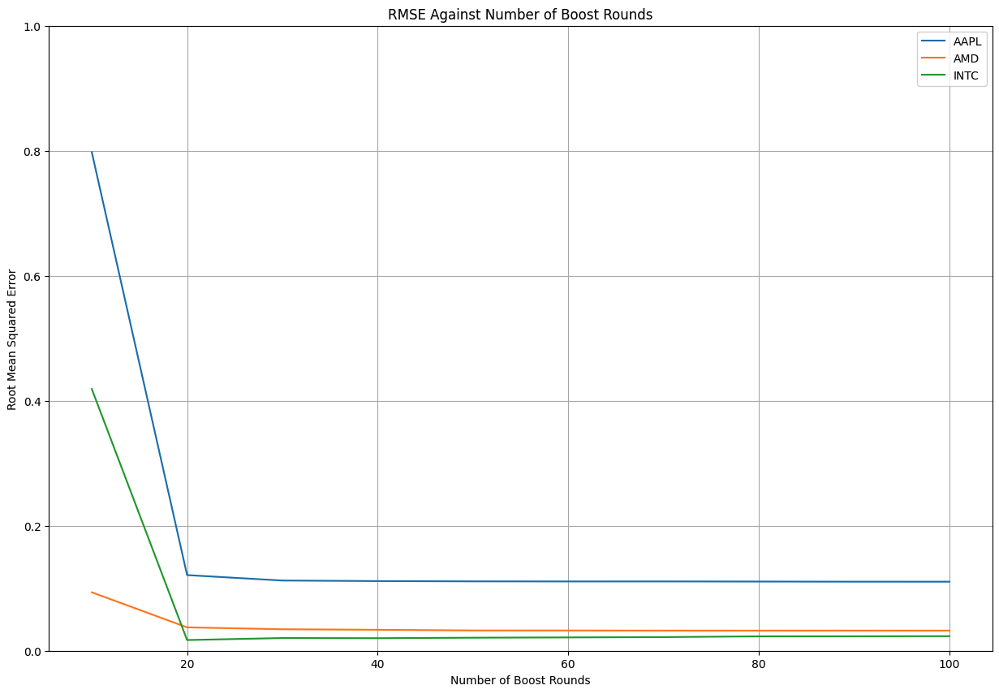

# Machine Learning: Group 6 - Project Proposal

### Team Members: Curran Myers, Tilman Gromme, Braden Dunaway, Bryce McNealey, Justin Yang

## Project Introduction and Background

It's difficult and complex for hedge funds and day traders to increasingly outperform the market (i.e. stable index funds) over a long time. Stock market public accessibility is increasing with technologies like Robinhood, TD Ameritrade, Bitwallet, etc becoming more relevant. Accurate predictions of the stock market can assist in education and help advise important financial planning and decisions for companies and individuals alike. As the use of complex machine learning rises, so does its integration with financial analysis.

---

## Problem Definition

Our team seeks to outperform the market (index funds: S&P 500, NASDAQ, etc.). We predict the weekly opening price of stocks using a random forest regression, and a regression with XGBoost. We are also classifying stocks as successful (increased open price) or not.

---

## Dataset
For our dataset, we are making use of [Marketdata’s API](https://docs.marketdata.app/api) to collect daily historical data for thousands of stock symbols over the past two decades.  The stock symbols are gathered from the [NASDAQ’s Stock Sceener](https://www.nasdaq.com/market-activity/stocks/screener), which provides basic information on stocks listed on the NASDAQ, NYSE, and AMEX.  This data will provide a solid foundation for engineering other indicator features to help the model predict future results.  Additionally, building a custom dataset allows the team to preprocess out unnecessary or irrelevant data thus reducing the overhead for data cleaning.

---

## Potential Methods and Techniques

For our model we will consider:
- **Random Forest Regression**: We would utilize an ensemble of decision trees, each with their own subset of (financial) features and samples (of stocks), to predict which stocks we should purchase and sell. We anticipate this method will be effective in capturing feature relationships and reducing overfitting. 

- **XGBoost**: As an option to further the Random Forest Regression, we will also consider using Extreme Gradient Boosting.  Due to the fact our data will be a time series, the sequential training XGBoost provides will help to more accurately extrapolate and forecast the trends in our data.  XGBoost has a python package from the developers **xgboost** [1].

- **Naive Bayes**: Assumes the stock’s features are conditionally independent and using Bayes Theorem, predicts the direction of stock price movements to suggest which stocks we may purchase or sell. We can use a variety of libraries to accomplish this, including **sci-kit-learn**.

To provide whichever model we decide to use with quality data, we will employ several methods in preprocessing to aid in reducing training time while maintaining data integrity and information.  These methods include feature engineering and compression among others. Ideally this process will make the model perform equally well if not better while reducing overhead.

---

### Dataset Cleaning

As stated earlier we used [Marketdata’s API](https://docs.marketdata.app/api) to collect information on numerous different stocks detailed by [NASDAQ’s Stock Sceener](https://www.nasdaq.com/market-activity/stocks/screener).  The data was gathered by making numerous HTTP GET requests and a response was recevied, which was then saved in JSON format.  If the response was empty or an error for no available data, it was not saved to alleviate preprocessing overhead.  Once all the stock data was gathered, we had received roughly 20 years worth of daily measures for thousands of different stocks.

<center>  </center>

We decided the the most "normal" selection of data would be from March 1st, 2009 through Feb 28th, 2020.  This would ideal train the model on the economy in a "normal" period uneffected by the 2008 housing crisis or the 2020 pandemic.  So, now all that was left to do was select all stocks that had completeness across the years and days within the year.  Even though a large portion of the data was not complete through the time range we selected, we still are left with a notable quantity of data for our base dataset. 

### Exploratory Data Analysis

In EDA, the goal was to better understand our data before doing any additional processing.  The first thing we did (knowing all NaN values had already been processed out) was generate some descriptive statistics on each stock by grouping them.  We realized that there were some stocks that were far too large or small to be included within the data.  So, we decided to bound the data from a minimum of 1 to a maximum of 500.
<br>
<center></center>
<br>
We then performed some analysis on how the stocks were distributed among sectors.  For risk assessment of a portfolio later, it is beneficial to not keep all investments in one sector as sectors can trend as a whole.  To gather some insights into this information, the naive solution was to plot the count of stocks present for each sector.  We also used KDE to visualize the distribution of the average opening price for all stocks in the sector across the time time range.  Together, we observed that out dataset does have a bias towards the finance and consumer discretionary sectors, but the relative maximum likelihood across sectors is fairly similar.
<br>
<center>


</center>
<br>
Lastly, we decided to do some noramlization of the data.  Using sklearn and numpy, we were able to create NxM arrays of the opening and closing prices each day in order to calculate the daily movements of a stock.  Below we show how we can use the normalizer to preprocess our data for the model.
<br>
<center></center>

---

### Feature Engineering

We sought out to add additional features to our dataset, including highly recommended features for time series financial data.

We considered that daily changes in stock features may be so minute as to overcomplicate the model, and with an excess of daily stock data over 10 years, we decided to reduce the dataset to weekly values for each of the 500 stocks.

These features generated include logvolume, i.e. log(volume), 2 and 5 week lagging *momentum*, which is determined using close price: Close - Close(10 days ago)

After doing so, The dataset required cleaning to remove the first 30 days of data, as they contained NaNs for our lagging features. 
To clean this precautionarily, we defined the following function:
```
def clean_dataset(df):
    df.dropna(inplace=True)
    indices_to_keep = ~df.isin([np.nan, np.inf, -np.inf]).any(axis=1)
    return df[indices_to_keep].astype(np.float64)
```
Which drops any NaNs, infinite values, and converts our feature values to np.float64 as required to execute some sklearn functions.

Further, it makes much sense to plot feature correlations and begin to explore their variance for their feasibility in actual machine learning models. Using seaborn, the heatmap of feature correlations was generated: 
<br>
<center></center>
<br>
Note that High, Low, and Close appear correlated - we may therefore remove some to aid implementation.


---
## Methods 

We developed 3 models as described in our potential models and techniques.

## Results
<center></center>

The chart exhibits a comparative analysis of the average training runtimes for the XGBoost, Random Forest, and Naive Bayes models. The reported runtimes represent the mean execution duration averaged across 10 repetitions for each algorithm. The XGBoost model demonstrated the fastest training time at 0.098 seconds. The Random Forest algorithm followed at 5.02 seconds. Finally, Naive Bayes was the most efficient, requiring only 0.003 seconds on average to train the model.
### Random Forest 
<center></center>

The presented chart exhibits the relative feature importance values for the randomized regression forest model, expressed as percentages. Specifically, it delineates the proportional contribution of each input feature towards the predictive accuracy of the trained random forest algorithm

<center></center>

This visual depicts the residual distribution generated through the random forest regression modeling process. The residuals represent the deviation of the predicted values from the actual observed target variables in the test dataset.

<center></center>

This scatterplot exhibits the relationship between the actual observed values on the x-axis and the corresponding predictions generated by the model on the y-axis. Each coordinate pair represents the true target variable value from the test set and the predicted estimate respectively. We observed a mean squared error of 3.76.

### Naive Bayes Classification

We can use a supervised Naive Bayes learning model to attempt a classification of stocks as good stocks or bad stocks. This requires the seperation of our data into the company stock components which range across a decade. Our dataframe consists of the open, high, low, and close prices of the company stock data. This data is compared to the open prices of the stock on the next day, with the goal being to see how accurately we can predict this opening value of the stock with prior stock information. The overall predicted opening values of the stock the next day can then be compared to the actual opening value of the stock to determine how well our model is able to predict the market.

<center></center>

This scatterplot shows the relationship between the actual values of the opening stock for each company vs the predicted values of the opening stock for each company. Addition data can be gathered from the Naives Bayes model, including accuracy of prediction, the means squared error, etc.

### XGBoost

Our problem was addresssed using supervised regression machine learning techniques. This is demonstrated by the manner with which we supply both the stock features and our target prices. Our target values exist on a continuous, numerical scale (stock price, either close or open). Methods like random forest built on simplier regression by generating a decision tree of grouped feature sets, to determine a most effective, i.e. fit to the data model.  Using a roughly 2-year subset of the initial data (no additional features), we used XGBoost to provide us with predictions and then evaluated the root mean squared error between the training and the test.

<center></center>

As we increased the number of boost rounds, we saw a decline in the RMSE.  However, when evaluating over the full 10 year span, our RMSE increases dramatically.  This confirms our assumption that more features would be needed to accurately train the model and prevent overfitting.


## References

- [1] Chen, T., & Guestrin, C. (2016, August). Xgboost: A scalable tree boosting system. In Proceedings of the 22nd acm sigkdd international conference on knowledge discovery and data mining (pp. 785-794).
- [2] Patel, J., Shah, S., Thakkar, P., & Kotecha, K. (2015). Predicting stock and stock price index movement using trend deterministic data preparation and machine learning techniques. Expert systems with applications, 42(1), 259-268.
- [3] Plevris, Vagelis & Solorzano, German & Bakas, Nikolaos & Ben Seghier, Mohamed. (2022). Investigation of performance metrics in regression analysis and machine learning-based prediction models. 10.23967/eccomas.2022.155. 

---

## Project Timeline


---

## Work Contribution Table

|       Task          |  Time Window  | Responsible Member(s) | Work Completed  |
|       :---:         |    :---:      |        :---:          |       :--:      |
| Research            | 06/06 - 06/13 | All Members           | All members contributed at least one resource or paper the group discussed in our meetings.|
| Proposal            | 06/13 - 06/16 | All Members           | All members contributed to the writing of the proposal, Curran recorded and submitted the video. |
| Data Collection     | 06/16 - 06/24 | Braden                | Curran and Braden collected data, ultimately the team decided on Braden's comprehensive pull of data stock data from the MarketData API. |
| Exp. Data Analysis  | 06/19 - 06/26 | Braden                | Braden generated data cleaning and analysis, including the plots and charts shown here. |
| Feature Engineering | 06/21 - 07/02 | Curran                | Curran generated new data features, and did the covariance analysis. |
| Comparing Models    | 06/23 - 07/05 | Bryce                 | Bryce calculated the RMSE and other statistics of the models as made by Tilman and Braden. | 
| Midterm Report      | 07/02 - 07/07 | All members           | All members collaborated in virtual meetings to complete the report that Braden submitted.|
| Implementation      | 07/07 - 07/19 | Tilman                | Bryce implemented a random forest model, Justin implemented a Naive Bayes model, and Braden an XGBoost model. |
| Model Tuning        | 07/14 - 07/21 | Justin                | Justin, Curran, and Bryce collaborated on data editing and model tuning to improve model performance. |
| Evaluation          | 07/19 - 07/24 | Curran                | Curran and Bryce determined metrics to track, Braden executed and put into the github. |
| Final Report        | 07/22 - 07/25 | All Members           | All members met virtually, recorded segments of the final report and contributed to submission. |

---

## Checkpoint

For team checkpoints, we meet weekly to review the progress of current phases and completed phases.  This aids in aligning our team on project goals and properly distributing work among team members.  These project meetings will occur until the project has reached completion at the end of the term.

